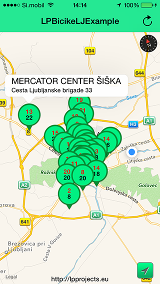

#LPBicikeljStationsFunctions

API for BicikeLJ http://www.bicikelj.si/



Created by Luka Penger
http://lukapenger.eu

#Usage

If you'd like to include this component as a pod using CocoaPods, just add the following line to your Podfile:

`pod "LPBicikeljStationsFunctions"`

#ARC

LPBicikeljStationsFunctions uses ARC (Automatic Reference Counting).

If you are using LPBicikeljStationsFunctions in your non-arc project, you will need to set a `-fobjc-arc` compiler flag on all of the LPBicikeljStationsFunctions source files.

To set a compiler flag in Xcode, go to your active target and select the "Build Phases" tab. Now select all LPBicikeljStationsFunctions source files, press Enter, insert `-fobjc-arc` and then "Done" to disable ARC for LPBicikeljStationsFunctions.

#Uses Frameworks - Libraries

* UIKit.framework
* Foundation.framework
* CoreLocation.framework

LPBicikeljStationsFunctions uses AFNetworking library for networking.
https://github.com/AFNetworking/AFNetworking


#Delegate methods

```objective-c
- (void)bicikeljStationsFunctionsWillLoadStations:(LPBicikeljStationsFunctions *)bicikeljStationsFunctions;
- (void)bicikeljStationsFunctions:(LPBicikeljStationsFunctions *)bicikeljStationsFunctions didLoadStations:(NSMutableArray *)stationsList;
- (void)bicikeljStationsFunctions:(LPBicikeljStationsFunctions *)bicikeljStationsFunctions errorLoadingStations:(NSError *)error;
- (void)bicikeljStationsFunctionsWillLoadStationsDetails:(LPBicikeljStationsFunctions *)bicikeljStationsFunctions;
- (void)bicikeljStationsFunctions:(LPBicikeljStationsFunctions *)bicikeljStationsFunctions didLoadStationsDetails:(NSMutableArray*)stationsList;
```

```objective-c
#pragma mark - LPBicikeljStationsFunctions Delegate

- (void)bicikeljStationsFunctionsWillLoadStations:(LPBicikeljStationsFunctions *)bicikeljStationsFunctions
{
    NSLog(@"bicikeljStationsFunctionsWillLoadStations");
}

- (void)bicikeljStationsFunctions:(LPBicikeljStationsFunctions *)bicikeljStationsFunctions didLoadStations:(NSMutableArray *)stationsList
{
    NSLog(@"bicikeljStationsFunctions - didLoadStations");
}

- (void)bicikeljStationsFunctionsWillLoadStationsDetails:(LPBicikeljStationsFunctions *)bicikeljStationsFunctions
{
    NSLog(@"bicikeljStationsFunctionsWillLoadStationsDetails");
}

- (void)bicikeljStationsFunctions:(LPBicikeljStationsFunctions *)bicikeljStationsFunctions didLoadStationsDetails:(NSMutableArray *)stationsList
{
    NSLog(@"bicikeljStationsFunctions - didLoadStationsDetails");
}

- (void)bicikeljStationsFunctions:(LPBicikeljStationsFunctions *)bicikeljStationsFunctions errorLoadingStations:(NSError *)error
{
    NSLog(@"bicikeljStationsFunctions - errorLoadingStations: %@", error);
}
```

##License

This code is distributed under the terms and conditions of the [MIT license](https://github.com/luka1995/LPBicikeljStationsFunctions/blob/master/LICENSE).

##Change log

A brief summary of each LPBicikeljStationsFunctions release can be found on the [wiki](https://github.com/luka1995/LPBicikeljStationsFunctions/wiki/Change-log).